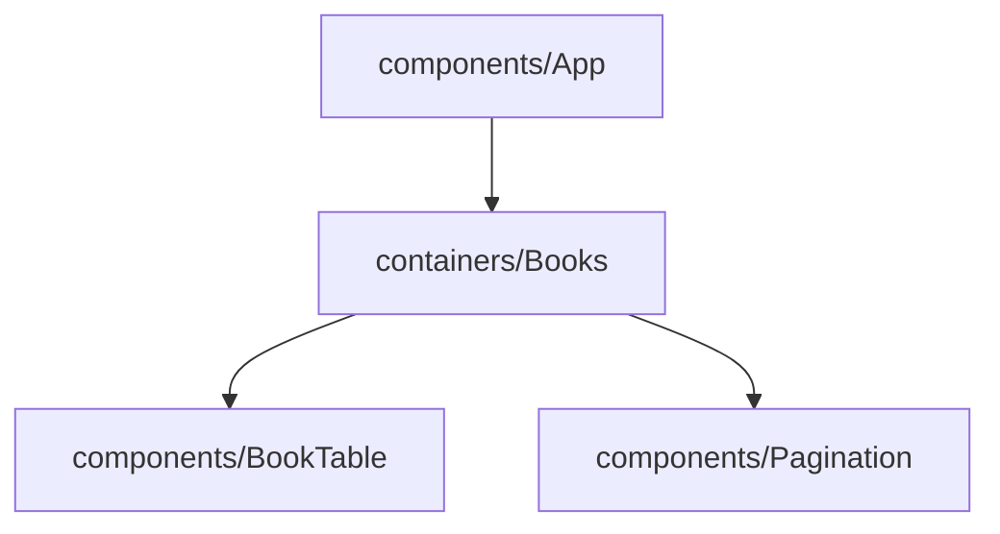

## Getting Started

**Step 1:** Clone this repo
   
```bash
$ git clone git@github.com:silasburger/getground-takehome.git

```

**Step 2:** Install dependencies

```bash
$ cd getground-books
$ yarn install

```

**Step 2:** Startup frontend

```bash
$ yarn start (in getground-books dir)

```
**Step 5: Go to http://localhost:3000 in browser**

## Component Heirarchy 



## Future Improvements
- Add filter input
- Improve UI 
- Retreiving books in batches and handling some pagination logic on the frontend
  - This would be useful for expensive queries
- Further testing
  - Testing the actions, reducer, and container is a good place to improve testing

