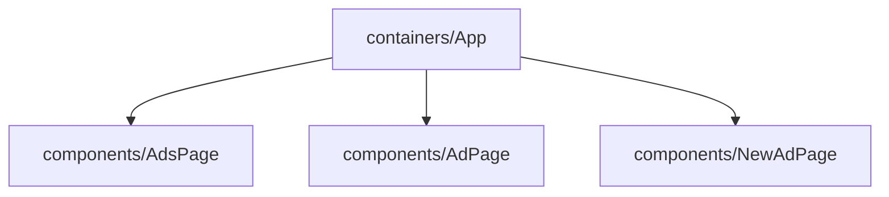

## Getting Started

**Step 1:** Clone this repo
   
```bash
$ git clone git@github.com:silasburger/mobile.git

```

**Step 2:** Install dependencies

You should have yarn and python3 installed.

```bash
$ cd mobile-react
$ yarn install
```

```bash
$ cd mobile-flask
$ python3 -m venv venv
$ pip3 install -r requirements.txt
```

**Step 2:** Startup app
```bash
$ cd mobile-flask
$ python3 seed.py
$ python3 app.py
```

```bash
$ cd mobile-react
$ yarn start
```

**Step 5: Go to http://localhost:3000 in browser**

## Component Heirarchy 



## Future Improvements
- Add tests
- Improve UI 
- Add pagination

